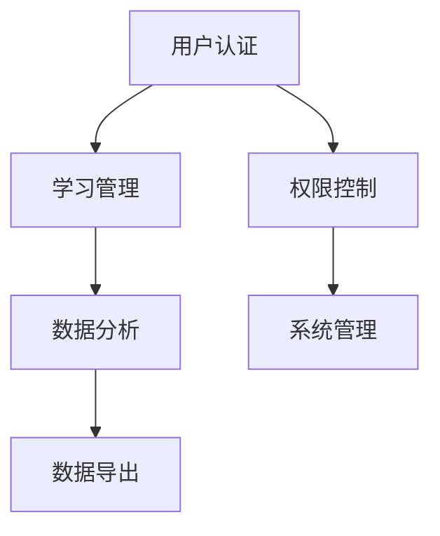

# 学习质效分析微信小程序

[](#)
[](https://opensource.org/licenses/MIT)
[](https://developers.weixin.qq.com/miniprogram/dev/)

> 一个用于学习时间管理和学习效果分析的教育类微信小程序

## 📖 项目简介

学习质效分析微信小程序是一款专为教育机构和学员设计的学习管理工具。通过科学的数据记录和分析，帮助用户优化学习方法，提升学习效率。

### ✨ 核心特性

- 🔐 **微信授权登录** - 安全便捷的用户认证
- 📝 **学习时间管理** - 便捷的学习时间记录和统计
- 📊 **数据分析可视化** - 多维度学习数据分析和展示
- 👥 **多角色权限管理** - 支持学员、管理员等不同角色
- 🔔 **智能提醒** - 学习进度跟踪和提醒通知
- 📤 **数据导入导出** - 支持Excel格式的批量数据处理

### 🎯 适用场景

- **教育机构** - 学员学习时间管理和效果分析
- **培训中心** - 培训进度跟踪和数据统计
- **个人学习** - 个人学习时间管理和分析

## 🚀 快速开始

### 环境要求

- [微信开发者工具](https://developers.weixin.qq.com/miniprogram/dev/devtools/download.html) (最新版本)
- Node.js 14.0+ (可选)

### 安装步骤

1. **克隆项目**
   ```bash
   # 使用实际的项目地址
   git clone <your-repository-url>
   cd study-analysis-miniprogram
   ```

2. **导入项目**
   - 打开微信开发者工具
   - 选择"导入项目"
   - 选择项目目录
   - 配置AppID (可使用测试号)

3. **配置后端API**
   ```javascript
   // 在 app.js 中修改API地址
   globalData: {
     baseUrl: 'http://140.143.143.195/api'  // 当前使用的API地址
   }
   ```

4. **开始开发**
   - 编译运行
   - 在模拟器中预览
   - 支持真机调试

### 快捷启动

```bash
# Windows用户可以双击运行
start.bat

# 检查API状态
check-api-status.bat

# 或使用npm命令
npm run help
```

### API状态检查

使用统一的API检查脚本（位于 `scripts/` 目录）：

```bash
# Windows
scripts\api-check.bat           # 快速检查（默认）
scripts\api-check.bat detailed  # 详细检查

# Linux/Mac  
bash scripts/api-check.sh           # 快速检查（默认）
bash scripts/api-check.sh detailed  # 详细检查
```

**工具层次:**
- **快速检查**: `scripts/api-check.*` - 日常状态验证
- **开发测试**: `dev-tools/api-tester/` - 完整测试套件  
- **前端集成**: `utils/backend-check.js` - 小程序内检查

**最新检查结果**: ✅ 服务器正常运行，文档API就绪，发现4个技术文档，API同步工具完全就绪  
**后端API状态**: 🔄 部分实现 (基础服务可用，具体接口待开发)  
**文档API状态**: ✅ 完全可用 (支持文档查询、搜索、反馈提交)  
**状态报告**: [docs/api-status-report.md](./docs/api-status-report.md)

## 📁 项目结构

```
├── app.js                 # 全局应用逻辑
├── app.json              # 全局配置文件
├── app.wxss              # 全局样式文件
├── version.json          # 版本信息
├── package.json          # 项目配置
│
├── pages/                # 页面目录
│   ├── login/            # 登录页面
│   ├── index/            # 首页
│   ├── profile/          # 个人中心
│   ├── study-report/     # 学习填报
│   ├── analysis/         # 数据分析
│   ├── management/       # 管理页面
│   └── role-switch/      # 角色切换
│
├── utils/                # 工具函数
│   └── storage-helper.js # 存储工具
│
├── images/               # 图片资源
├── docs/                 # 文档目录
│   ├── README.md         # 文档索引
│   ├── DEVELOPMENT.md    # 开发文档
│   ├── API_REQUIREMENTS.md # 后端需求文档
│   ├── CHANGELOG.md      # 变更日志
│   ├── PROJECT_DELIVERY.md # 项目交付文档
│   ├── BACKEND_INTEGRATION_COMPLETE.md # 后端集成验收
│   └── FRONTEND_INTEGRATION_GUIDE.md # 前端集成指南
│
├── scripts/                    # 🔧 统一API检查脚本
│   ├── api-check.bat          # Windows API检查
│   ├── api-check.sh           # Linux/Mac API检查  
│   └── README.md              # 脚本使用说明
│
└── .vscode/             # VS Code配置
```

## 🔧 开发指南

### 开发规范

- **代码风格**: 使用驼峰命名法，添加必要注释
- **文件命名**: 使用kebab-case命名页面和组件
- **Git提交**: 遵循[约定式提交](https://www.conventionalcommits.org/zh-hans/)规范

### 主要页面

| 页面 | 路径 | 描述 |
|------|------|------|
| 登录页 | `/pages/unified-login/unified-login` | 微信授权登录和身份绑定 |
| 首页 | `/pages/index/index` | 数据概览和快捷操作 |
| 学习填报 | `/pages/study-report/study-report` | 学习时间记录 |
| 数据分析 | `/pages/analysis/analysis` | 学习数据分析展示 |
| 个人中心 | `/pages/profile/profile` | 用户信息和设置 |

### API集成

所有API请求通过`app.js`中的`request`方法统一处理：

```javascript
const app = getApp();

app.request({
  url: '/study/submit',
  method: 'POST',
  data: {
    date: '2025-08-20',
    studyTime: 3.5,
    subject: '数学'
  },
  success: (res) => {
    console.log('提交成功:', res);
  },
  fail: (err) => {
    console.error('提交失败:', err);
  }
});
```

## 📚 文档

- [� 文档索引](./docs/README.md) - 完整的文档导航和项目状态
- [�📖 开发文档](./docs/DEVELOPMENT.md) - 详细的开发指南和技术文档
- [🔌 API需求文档](./docs/API_REQUIREMENTS.md) - 后端接口需求和实现状态
- [📝 变更日志](./docs/CHANGELOG.md) - 版本更新记录
- [� 模块整合总结](./docs/MODULE_CONSOLIDATION_SUMMARY.md) - 项目模块整合和优化记录
- [�🚀 项目交付文档](./docs/PROJECT_DELIVERY.md) - 项目交付说明和检查清单
- [🔧 后端集成完成文档](./docs/BACKEND_INTEGRATION_COMPLETE.md) - 后端集成验收标准
- [📋 前端集成指南](./docs/FRONTEND_INTEGRATION_GUIDE.md) - 前端接口集成指南

### 📊 实时状态
- **文档API进度**: 100% (完全可用)
- **后端API进度**: 15% (基础服务+文档API)
- **服务器状态**: ✅ 运行中 (`140.143.143.195`)
- **核心功能**: ✅ 已就绪 (前端完整，后端部分可用)
- **文档同步**: ✅ 实时可用 (4个技术文档)

## 🏗️ 技术架构

### 前端技术栈

- **框架**: 微信小程序原生框架
- **样式**: WXSS + CSS3
- **状态管理**: 页面级数据管理
- **网络请求**: wx.request封装
- **本地存储**: wx.storage API

### 核心功能模块



## 🔐 权限管理

### 用户角色

| 角色 | 权限描述 | 功能范围 |
|------|----------|----------|
| **学员** (student) | 基础功能 | 记录学习时间，查看个人数据 |
| **层级长** (instructor) | 团队管理 | 管理团队成员，查看团队数据 |
| **信息管理员** (manager) | 数据管理 | 用户管理，数据导入导出 |
| **超级管理员** (admin) | 系统管理 | 系统配置，全局数据管理 |

### 权限验证

```javascript
// 页面级权限检查
onLoad: function() {
  const userRole = getApp().globalData.userRole;
  if (!this.checkPermission(userRole)) {
    wx.navigateBack();
  }
}
```

## 📊 数据模型

### 用户信息
```javascript
{
  id: "user_001",
  name: "张三",
  studentId: "ST001",
  role: "student",
  unitName: "计算机科学与技术学院"
}
```

### 学习记录
```javascript
{
  id: "record_001",
  userId: "user_001",
  date: "2025-08-20",
  studyTime: 3.5,
  subject: "数学",
  note: "复习微积分"
}
```

## 🧪 测试

### 功能测试

- [x] 用户登录和身份绑定
- [x] 学习时间记录和查询
- [x] 数据分析和可视化
- [x] 权限控制和角色切换
- [x] 数据导入导出

### 测试账号

> 🔒 **安全提示**: 测试账号信息请联系项目管理员获取，或查看开发文档中的相关说明。

### 测试命令

```bash
# 代码检查
npm run lint

# 功能测试
npm run test

# 性能测试
npm run test:performance
```

## 📱 部署

### 开发环境
1. 配置测试API地址
2. 使用测试AppID
3. 启用调试模式

### 生产环境
1. 配置生产API地址
2. 申请正式AppID
3. 关闭调试模式
4. 提交微信审核

### 部署检查清单

- [ ] API地址配置正确
- [ ] 图片资源优化
- [ ] 代码混淆和压缩
- [ ] 功能完整性测试
- [ ] 性能优化检查
- [ ] 安全性检查

## 🐛 故障排除

### 常见问题

#### 登录失败
```javascript
// 检查网络状态
wx.getNetworkType({
  success: (res) => {
    console.log('网络类型:', res.networkType);
  }
});
```

#### 数据同步问题
```javascript
// 清理本地缓存
wx.clearStorageSync();
// 重新登录
app.logout();
```

#### 页面显示异常
- 检查CSS样式冲突
- 确认数据格式正确
- 查看控制台错误信息

## 🤝 贡献

我们欢迎任何形式的贡献！

### 贡献流程

1. Fork 本项目
2. 创建功能分支 (`git checkout -b feature/AmazingFeature`)
3. 提交更改 (`git commit -m 'feat: add some AmazingFeature'`)
4. 推送到分支 (`git push origin feature/AmazingFeature`)
5. 创建 Pull Request

### 提交规范

```
feat: 新功能
fix: 修复问题
docs: 文档更新
style: 代码格式调整
refactor: 代码重构
test: 测试相关
chore: 构建/工具相关
```

## 📈 路线图

### v1.1.0 (计划: 2025年9月)
- [ ] 学习计划制定功能
- [ ] 学习提醒优化
- [ ] 界面主题切换
- [ ] 数据导出格式扩展

### v1.2.0 (计划: 2025年10月)
- [ ] 学习小组功能
- [ ] 排行榜系统优化
- [ ] 学习成就系统
- [ ] 离线数据同步

### v2.0.0 (计划: 2025年12月)
- [ ] AI学习建议
- [ ] 智能数据分析
- [ ] 个性化推荐
- [ ] 多端数据同步

## 📄 许可证

本项目采用 [MIT](https://opensource.org/licenses/MIT) 许可证。

## 📞 支持

### 联系方式
- **项目维护**: 方九日 (moqiqingxuan@gmail.com)
- **单位**: 陕西师范大学
- **问题反馈**: 请通过项目Issues提交问题和建议
- **技术支持**: 请查看docs/目录下的相关文档

### 社区
- **文档**: 查看docs/README.md获取完整文档
- **开发指南**: 参考docs/DEVELOPMENT.md
- **API文档**: 查看docs/API_REQUIREMENTS.md

---

<div align="center">

**⭐ 如果这个项目对你有帮助，请给它一个星标！ ⭐**

Made with ❤️ by 方九日 

</div>
